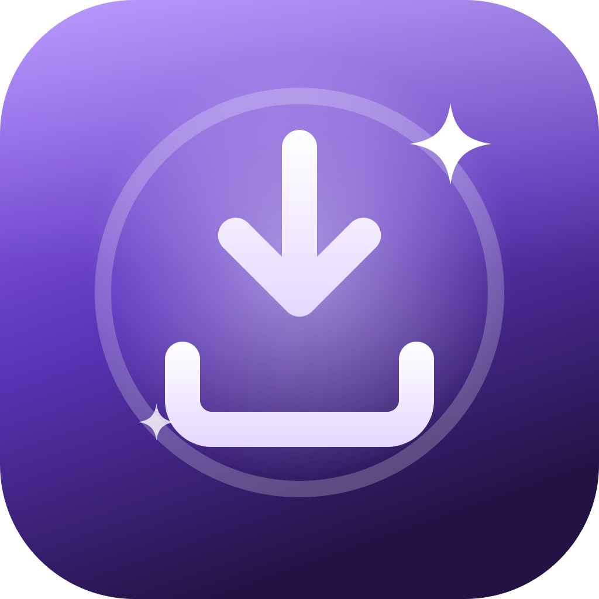

<p align="center">
  
</p>

<h1 align="center">AltLoad</h1>

<p align="center"><b>Install AltStore or Catalyst (and your own IPAs) on your iPhone using just your iPhone, with no computer involved.</b></p>

Normally, installing [AltStore](https://altstore.io) requires AltServer running on a Mac or PC. AltLoad does that job on the iPhone itself. It pairs the iPhone with itself, signs AltStore with your Apple ID, and installs it. When the 7-day signature is about to run out, you refresh it in AltLoad with one tap.

Built with SwiftUI for iOS 27, with a dark purple theme and Liquid Glass.

> [!WARNING]
> **Early preview.** AltLoad hasn't been tested properly yet. Expect bugs, and please [open an issue](https://github.com/mirazbakis/AltLoad/issues) if something doesn't work.

> AltLoad is an independent project. It is not affiliated with AltStore, Riley Testut, SideStore or Apple.

---

## What you need

- An iPhone or iPad on **iOS 27 or later**.
- **Developer Mode** turned on (**Settings › Privacy & Security › Developer Mode**).
- **[LocalDevVPN](https://apps.apple.com/app/id6755608044)**, a free app from the App Store. It lets the iPhone connect to itself (see [How it works](#how-it-works)).
- An **Apple ID**. A free one is fine: apps then last 7 days, and you can have up to 3 sideloaded apps at once.
- Wi-Fi, for the one-time pairing step.

## Installing AltLoad

AltLoad is a sideloaded app, so you install the `.ipa` the same way as any other sideloaded app.

1. Download **`AltLoad.ipa`**:
   - the latest stable build is on the [**Releases**](https://github.com/mirazbakis/AltLoad/releases) page,
   - the newest build of `main` is always at [**Nightly build**](https://github.com/mirazbakis/AltLoad/releases/tag/nightly), which needs no GitHub account, or
   - the newest development build is on the [**Actions**](https://github.com/mirazbakis/AltLoad/actions) page. Open the latest green run and download **AltLoad.ipa** from **Artifacts**. You need to be signed in to GitHub for this.
2. Sign and install it with whatever you already use to sideload: AltStore, SideStore, Sideloadly, Xcode or another signing tool.
3. If iOS says the developer isn't trusted, go to **Settings › General › VPN & Device Management**, tap your Apple ID and choose **Trust**.

## Using AltLoad

1. **Pair this iPhone (once).** Open **Tools › Pair** and tap **Pair This iPhone or iPad**. Then go to **Settings › Privacy & Security › Developer Mode**, scroll down, tap **Pair with AltLoad**, and enter the code AltLoad shows you.
2. **Set up LocalDevVPN (once).** Install it from the App Store and open it once so it can add its VPN configuration.
3. **Install a store.** Open the **Install** tab, pick **AltStore** (the default) or **Catalyst**, tap **Install**, sign in with your Apple ID and enter the two-factor code. If LocalDevVPN is off, AltLoad asks you to turn it on, then continues by itself.
4. **Trust it.** The first time you open AltStore, trust your Apple ID in **Settings › General › VPN & Device Management**.
5. **Use AltStore normally.** AltLoad runs its own **AltServer** on the iPhone, so AltStore can install and refresh apps without a computer. Keep AltLoad open while it works, or turn on background mode in **Tools › AltServer**. LocalDevVPN has to be on.
6. **Refresh every week.** With a free Apple ID, apps stop opening after 7 days. Refresh in AltStore, or in AltLoad (**Install** tab, or the pill in **Tools › Library**). AltLoad reminds you the day before.

> **How AltStore finds AltLoad.** AltStore first asks, through a system notification, whether an AltServer is connected over USB. AltLoad answers and connects to AltStore on the iPhone itself, so AltStore picks it before anything else. AltLoad also advertises itself on Wi-Fi with the server ID it wrote into AltStore. The installs, provisioning profiles and app removal AltStore asks for go through LocalDevVPN, like AltLoad's own installs.

### What's in the app

| Tab | What it does |
|---|---|
| **Install** | Pick AltStore (default) or [Catalyst](https://github.com/mirazbakis/Catalyst), then install, refresh or update it, always the newest version from its source. **Install an IPA** signs any `.ipa` you pick with your own free Apple ID certificate and installs it. Installs run full screen with a step-by-step progress bar (LocalDevVPN, device link, Apple sign-in, signing, installing). Catalyst gets this iPhone's pairing file placed inside it automatically. |
| **Tools** | **AltServer** (status, background mode, activity log) · **Pair** (pairing files for this iPhone, another iPhone or iPad, or an Apple TV) · **Pairing File to Apps** (copies the pairing file into Catalyst, SideStore, StikDebug or any development-signed app) · **Library** (every app AltLoad installed, with a days-left pill you tap to refresh, plus saved pairing files) · **Certificates** (your Apple ID's certificates, App IDs and devices). |
| **Settings** | Apple ID, default store and store sources, anisette server, LocalDevVPN and background options. |

## Building the IPA yourself

You don't need a Mac for this: GitHub can build it for you.

### On GitHub (no Mac needed)

1. **Fork** this repository (the **Fork** button at the top right).
2. In your fork, open the **Actions** tab and enable workflows if GitHub asks.
3. Run **Build unsigned IPA**, either by clicking **Run workflow** or by pushing a commit.
4. When it finishes (about 10–20 minutes the first time), download **AltLoad.ipa** from the run's **Artifacts**.

To publish a release, push a tag starting with `v` (for example `v1.0.0`). The workflow attaches `AltLoad.ipa` to a GitHub Release automatically.

> Actions minutes are free for public repositories. Private repositories use your monthly allowance, and macOS minutes count 10×.

### On a Mac

You need **Xcode 27**, [Homebrew](https://brew.sh) and [Rust](https://rustup.rs).

```sh
brew install xcodegen
rustup target add aarch64-apple-ios aarch64-apple-ios-sim

git clone https://github.com/mirazbakis/AltLoad.git
cd AltLoad
./build-rust.sh        # compiles the Rust part into AltLoadFFI.xcframework
xcodegen generate      # creates AltLoad.xcodeproj from project.yml
```

Then do one of the following:

- **Run it from Xcode:** `open AltLoad.xcodeproj`, choose your Team under **Signing & Capabilities**, set a unique bundle identifier (for example `com.yourname.AltLoad`), plug in your iPhone and press **Run**.
- **Make an unsigned IPA:**
  ```sh
  xcodebuild -project AltLoad.xcodeproj -scheme AltLoad -configuration Release \
    -sdk iphoneos -destination 'generic/platform=iOS' -derivedDataPath build/dd \
    CODE_SIGNING_ALLOWED=NO CODE_SIGNING_REQUIRED=NO build
  mkdir -p build/Payload
  cp -R build/dd/Build/Products/Release-iphoneos/AltLoad.app build/Payload/
  (cd build && zip -qr ../AltLoad.ipa Payload)
  ```

Xcode doesn't need to know about new source files: anything in `App/` is picked up automatically. Run `xcodegen generate` again after adding files.

## How it works

The short version is below. [`docs/HOW-IT-WORKS.md`](docs/HOW-IT-WORKS.md) covers every step in detail.

1. **Pairing.** On iOS 27, a device can pair wirelessly with a "host" it finds on the network. AltLoad acts as that host, so the iPhone pairs with AltLoad the same way it would pair with a Mac. The result is a pairing file.
2. **Reaching itself.** An app can't normally talk to its own iPhone's system services the way a computer can. LocalDevVPN routes one address (`10.7.0.1`) back into the phone, so AltLoad's connection looks like it's coming from another device. AltLoad then opens the same secure tunnel that Xcode uses.
3. **Apple ID.** AltLoad signs in to Apple's developer services with your Apple ID. It registers your iPhone, gets a development certificate, and creates the App IDs and provisioning profiles AltStore needs.
4. **Signing.** It adds the details AltServer would normally write into AltStore, then signs AltStore and its extensions.
5. **Installing.** It copies the signed app onto the iPhone through the tunnel and asks iOS to install it.

## Privacy and security

- **Your Apple ID password goes only to Apple.** If you choose *Remember password*, it's stored in the iPhone's Keychain, is only readable while the phone is unlocked, and never syncs to iCloud.
- **Anisette server:** Apple requires extra device-identity headers ("anisette") before it accepts a sign-in. AltLoad gets them from a public anisette server, SideStore's `ani.sidestore.io` by default. You can choose another server or your own in Settings. The anisette server never sees your password.
- **Pairing files** give access to your device. Only share them with apps you trust.
- **Using a secondary Apple ID** is a common choice for sideloading. It works fine with AltLoad.

## FAQ

**Does this need a computer at all?**
You don't need one to install or refresh AltStore. You do need some way to sideload AltLoad itself the first time.

**Why iOS 27?**
The on-device pairing AltLoad depends on (**Pair with…** under Developer Mode) was added in iOS 27.

**Sign-in fails with an anisette error.**
The anisette server may be down. Pick another one in **Settings › Anisette server** and try again.

**It says the certificate limit is reached.**
Free Apple IDs can only have a few development certificates. AltLoad asks which one to revoke. Apps signed with the revoked certificate, for example by another computer, stop opening until they're signed again.

**It can't connect to the iPhone.**
Check that LocalDevVPN is connected, Developer Mode is on, and you've paired this iPhone in the Pair tab. If it still fails, pair again.

## Credits

AltLoad is built on the work of:

- [**idevice**](https://github.com/jkcoxson/idevice) by Jackson Coxson: device pairing, the tunnel, and file transfer and installation.
- [**isideload**](https://github.com/nab138/isideload) by nab138: Apple ID sign-in, developer services and code signing.
- [**StikPair**](https://github.com/StephenDev0/StikPair) by StephenDev0: the on-device pairing flow AltLoad is based on.
- [**LocalDevVPN**](https://github.com/jkcoxson/LocalDevVPN) by jkcoxson and Stossy11: the loopback VPN.
- [**AltStore**](https://altstore.io) by Riley Testut and Shane Gill. AltLoad downloads AltStore from its official source at install time and does not redistribute it.

## License and terms

AltLoad is released under the **[AltLoad License](LICENSE)**. You may use, modify and share it for free, for **non-commercial** purposes. Selling it, bundling it into a paid product or service, or distributing it for money requires written permission. Forks must say they're modified and can't use the AltLoad name or logo as their own.

Parts of AltLoad come from [StikPair](https://github.com/StephenDev0/StikPair) (non-commercial MIT) and [idevice](https://github.com/jkcoxson/idevice) (MIT). Those parts stay under their original licenses, which are listed in [THIRD_PARTY_NOTICES.md](THIRD_PARTY_NOTICES.md).

Using AltLoad means you agree to the **[Terms of Service](https://mirazbakis.github.io/terms.html)**.

Found a security problem? See **[SECURITY.md](SECURITY.md)**. Please don't report it in a public issue.
